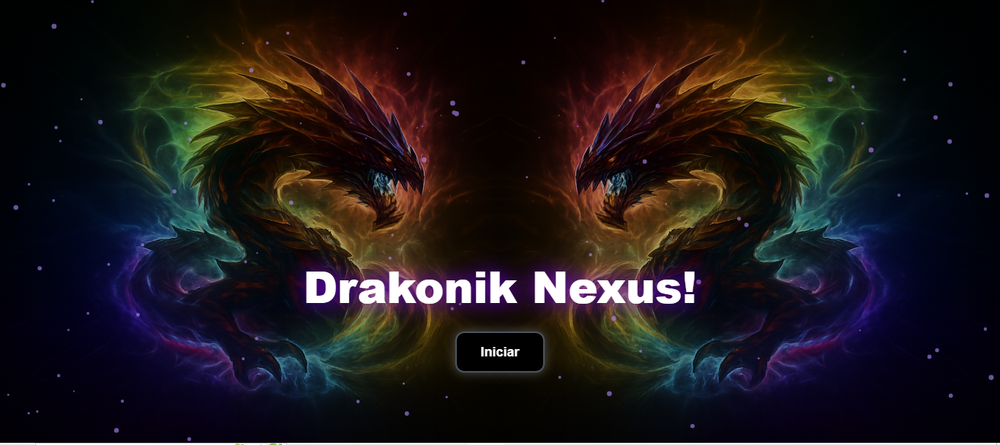

<h2 id="sobre-o-projeto">1. 🎮 Sobre o Projeto</h2>


[](https://github.com/Domisnnet/GitHub-Stats/edit/main/LICENSE)



Um jogo de cartas da memória inspirado em **Yu-Gi-Oh!**, desenvolvido com **Vue.js** e **Vite** — diversão e código em um só duelo!<br>
O **Drakonik-Nexus-Vue** é um jogo da memória com temática inspirada no universo de Yu-Gi-Oh! O objetivo é simples: encontrar todos os pares de cartas no menor tempo possível. 

> 💡 Uma combinação entre **frontend moderno** e **nostalgia dos duelos de cartas**.

---

## 📚 Tabela de Conteúdo

| 🎮 O Jogo | 🛠️ Técnico | 🤝 Comunidade |
| :---: | :---: | :---: |
| [](#sobre-o-projeto) | [](#implantacao) | [](#codigo-fonte) |
| [](#tecnologias-utilizadas) | [](#como-contribuir) | [](#creditos) |
| [](#como-jogar) | [](#instalacao-local) | [](#licenca) |
| [](#regras-do-jogo) | [](#faq) | [](#perfil-do-github) |

---

<h2 id="tecnologias-utilizadas">2. ⚙️ Tecnologias Utilizadas</h2>

| Camada | Tecnologias | Descrição |
| :--- | :--- | :--- |
| **Frontend** |   | Interface reativa e build ultra-rápido. |
| **Estado/Rotas** |   | Gerenciamento de estado e navegação. |
| **Deploy** |   | Hospedagem de alta disponibilidade. |

---

<h2 id="como-jogar">3. 🚀 Como Jogar</h2>

| Passo | Ação |
| :---: | :--- |
| **1** | Escolha uma plataforma na seção de Implantação. |
| **2** | Clique em uma carta para revelá-la. |
| **3** | Encontre o par correspondente e complete o tabuleiro. |
| **4** | Vença o duelo no menor tempo possível! |

---

<h2 id="regras-do-jogo">4. 🧩 Regras do Jogo</h2>

* 🔹 **Cartas:** Ao virar duas cartas iguais, elas permanecem abertas.
* 🔹 **Erro:** Se forem diferentes, elas voltam à posição original após um breve tempo.
* 🔹 **Vitória:** O jogo encerra automaticamente ao encontrar todos os pares.

---

<h2 id="implantacao">5. 🌐 Implantação</h2>

O projeto está disponível para jogar online nos seguintes links:

| Plataforma | Status | Link de Acesso direto para o Jogo: |
| :--- | :---: | :--- |
| **GitHub Pages** |  | [](https://domisnnet.github.io/Drakonik-Nexus-Vue.Js/) |
| **Firebase Hosting** |  | [](https://drakonik-nexus-75177593-75741.web.app/) |


---

<h2 id="como-contribuir">6. 🤝 Como Contribuir</h2>

Adicione este projeto ao seu "deck" de desenvolvedor! Siga a jornada abaixo para fortalecer este projeto:

| Fase | Ação | Link / Comando |
| :---: | :--- | :--- |
| **01** | **Prepare o Terreno** | [](https://github.com/Domisnnet/Drakonik-Nexus-Vue.Js/fork) |
| **02** | **Crie uma Branch** | `git checkout -b feature/NovaMelhoria` |
| **03** | **Guarde as Mudanças** | `git commit -m 'feat: Adiciona nova funcionalidade'` |
| **04** | **Envie o Código** | `git push origin feature/NovaMelhoria` |
| **05** | **Desafio Final** | [](https://github.com/Domisnnet/Drakonik-Nexus-Vue.Js/compare) |


### 🐛 Encontrou um problema?
Se algo não estiver funcionando como esperado, não hesite em abrir um chamado:

[](https://github.com/Domisnnet/Drakonik-Nexus-Vue.Js/issues)
[](https://github.com/Domisnnet/Drakonik-Nexus-Vue.Js/issues/new)

---

<h2 id="instalacao-local">7. 🚀 Instalação e Configuração Local</h2>

```bash
# Clonar o repositório
git clone [https://github.com/Domisnnet/Drakonik-Nexus-Vue.Js.git](https://github.com/Domisnnet/Drakonik-Nexus-Vue.Js.git)

# Acessar a pasta
cd Drakonik-Nexus-Vue.Js
```

---

<h2 id="faq">8. 🧠 Perguntas Frequentes</h2>

<details>
<summary><strong>O que é o Drakonik-Nexus-Vue ❓</strong></summary>
<br>
<blockquote>
É um jogo de cartas da memória com estética inspirada em <strong>Yu-Gi-Oh!</strong>, desenvolvido para demonstrar o poder do <strong>Vue.js 3</strong> e <strong>Vite</strong> na criação de interfaces reativas e performáticas.
</blockquote>
</details>

<details>
<summary><strong>Como funciona o Deploy automático ❓</strong></summary>
<br>
<ul>
<li>🚀 <strong>Tecnologia:</strong> Utilizamos o <strong>GitHub Actions</strong> para CI/CD.</li>
<li>🔄 <strong>Fluxo:</strong> Ao detectar um <code>push</code> na branch <code>main</code>, o workflow compila o projeto e atualiza o <strong>GitHub Pages</strong> instantaneamente.</li>
</ul>
</details>

<details>
<summary><strong>Posso utilizar o código para meu próprio estudo ou contribuir ❓</strong></summary>
<br>

✅ **Com certeza!** O projeto é Open Source. Você pode clonar para estudar ou enviar melhorias.

**Para contribuir, acesse:**

[](https://github.com/Domisnnet/Drakonik-Nexus-Vue.Js/compare)

</details>

<details>
<summary><strong>O jogo é responsivo ❓</strong></summary>
<br>
📱 <strong>Sim!</strong> A interface foi construída com foco em dispositivos móveis e desktops, garantindo que o "duelo" funcione perfeitamente em qualquer tamanho de tela.
</details>

---

<h2 id="codigo-fonte">9. 💻 Código Fonte</h2>

Gostou do jogo? Explore o código ou faça sugestões:

[](https://github.com/Domisnnet/Drakonik-Nexus-Vue.js)

---

<h2 id="creditos">10. 📝 Créditos</h2>

* **Desenvolvedor 👨‍💻: DomisDev**.

---

<h2 id="licenca">11. 📄 Licença</h2>

Este projeto é *open source* e está licenciado sob a [](https://github.com/Domisnnet/Drakonik-Nexus-Vue.Js/edit/main/LICENSE)

---

<h2 id="perfil-do-github">12. 👨‍💻 Perfil do GitHub</h2>

<a href="https://github.com/Domisnnet">  </a>
